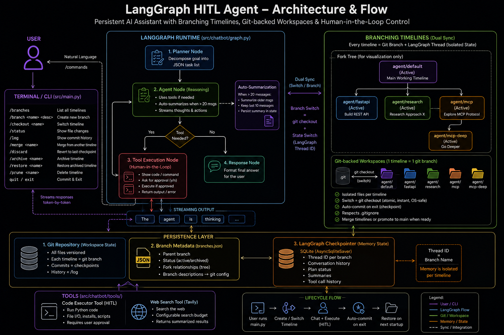

# LangGraph HITL Agent

A persistent, terminal-based AI assistant built on LangGraph with **git-backed branching timelines** and **human-in-the-loop** control. The agent can plan, reason, execute code, and search the web — while letting you explore multiple independent lines of work simultaneously, each with isolated files and conversation memory.

---



---

## Features

### 🤖 Core Agent
- **JSON Task Planner** — Automatically decomposes complex goals into a structured, trackable checklist shown live in the terminal.
- **Stateful Execution** — Remembers context and plan status across sessions using a SQLite checkpointer (via LangGraph's `AsyncSqliteSaver`).
- **Live Streaming** — Responses stream token-by-token to the terminal.
- **Human-in-the-Loop (HITL)** — Pauses before executing any code, shows you exactly what it's about to run, and asks for approval (`y/n`).

### 🌿 Branching Timelines
- Create independent **parallel timelines** from any point in a conversation.
- Each timeline has its own isolated **conversation memory** (via separate LangGraph thread IDs) and its own **file workspace** (via native Git branches).
- New timelines **inherit** the full conversation context and all files of the parent at the moment of branching.
- Timelines are fully independent after creation — no cascading rules between them.
- A **fork tree** is maintained purely for visualization (showing what knowledge each timeline inherited).

### 📂 Git-Backed File Isolation
- Each agent timeline maps 1-to-1 with a local Git branch (`agent/<name>`).
- Switching timelines = `git checkout` — atomic, instant, and OS-safe.
- On exit (`quit` or `Ctrl+C`), all workspace files are automatically committed as a checkpoint.
- On startup, the workspace is restored to the last checkpoint for that timeline.
- Respects `.gitignore` natively — no separate ignore file needed.

### 🧠 Auto-Summarization
- When conversation history exceeds **20 messages**, older messages are automatically summarized by the LLM into a single context block.
- The summary is persisted back into LangGraph state — summarization only happens once per threshold crossing.
- Always keeps the last **10 messages** verbatim for precise recent context.

### 🛠️ Tools
- **Code Executor** — Safely runs Python code with user approval. Supports file I/O, pip installs, and general scripting.
- **Web Search** — Searches the web via Tavily with a per-session search budget.

---

## Setup

### 1. Prerequisites

Make sure you have **Git** installed and initialized in your project:
```bash
git init
git add .
git commit -m "chore: initial commit"
```

### 2. Install dependencies

```bash
uv sync
```

### 3. Configure environment

Create a `.env` file in the project root:

```env
OPENAI_API_KEY=your_openai_api_key
TAVILY_API_KEY=your_tavily_api_key
```

> **Note:** The agent uses an OpenAI-compatible endpoint. To use a different provider, update `base_url` in `src/chatbot/nodes/llm.py`.

### 4. Run the agent

```bash
uv run src/main.py
```

On **first run**, the agent automatically creates the `agent/default` git branch and sets up the initial workspace.

---

## Commands

Once inside the agent, use these commands in addition to chatting:

| Command | Description |
|---|---|
| `history` | Show conversation history for the current timeline |
| `quit` / `exit` | Commit a checkpoint and exit |
| `/branches` | List all timelines with their status and fork tree |
| `/branch <name> <desc>` | Create a new timeline forked from the current one |
| `/checkout <name>` | Switch to a different timeline (commits current, restores target) |
| `/archive <name>` | Mark a timeline as archived (hidden but not deleted) |
| `/restore <name>` | Restore an archived timeline back to active |
| `/prune <name>` | Permanently delete a timeline and its git branch |
| `/status` | Show uncommitted file changes on the current timeline |
| `/log` | Show checkpoint history (git commits) for the current timeline |
| `/discard` | Revert all changes since the last checkpoint (also notifies agent memory) |
| `/merge <name>` | Merge file changes from another timeline into the current one |

---

## How Branching Works

```
main              ← stable/production branch — never worked on directly
└── agent/default ← primary working timeline (created automatically on first run)
        ├── agent/fastapi    ← /branch fastapi "build REST API"
        ├── agent/research   ← /branch research "research approach X"
        └── agent/mcp        ← /branch mcp "explore MCP protocol"
                └── agent/mcp-deep   ← /branch mcp-deep "go deeper"
```

- **All agent work happens on `agent/` branches** — `main` is only updated when you explicitly merge.
- Each branch has its own files **and** its own conversation memory.
- New branches inherit both the files and conversation of the parent at the moment of creation.
- After branching, all timelines are **completely independent**.

### Merging finished work

**Between agent timelines** (using `/merge` inside the agent):
```
/checkout default
/merge fastapi       ← brings fastapi's files into default
```

**Promoting to main** (in a terminal, outside the agent):
```bash
git checkout main
git merge agent/default
git push
```

---

## Project Structure

```
src/
├── main.py              # Entry point: terminal UI, streaming, all commands
├── tree_manager.py      # Branch metadata (branches.json read/write + git config)
├── snapshot_manager.py  # Git-based workspace switching (checkout/commit/branch)
└── chatbot/
    ├── graph.py         # LangGraph workflow and routing logic
    ├── state.py         # AgentState definition
    └── nodes/
    │   ├── agent.py     # Main reasoning node with auto-summarization
    │   ├── planner.py   # Task decomposition node
    │   └── llm.py       # LLM client configuration
    └── tools/
        ├── executor_tool.py  # HITL code execution tool
        └── websearch.py      # Tavily web search tool

data/
└── branches.json        # Timeline metadata (parent lineage + status)
                         # Branch descriptions stored in: git config branch.agent/<name>.description
                         # Branch timestamps from: git log
```